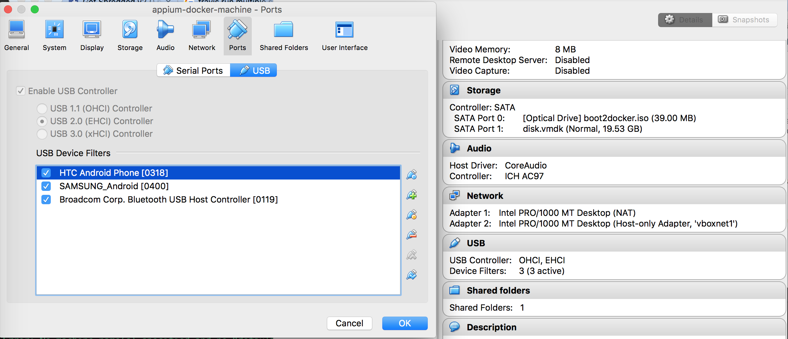

# Appium Docker for Android

### Images Included:

- appium/appium - Docker Image to run appium tests on real android devices.
- To execute in android emulator's please visit [docker-android](https://github.com/butomo1989/docker-appium.git)

## Setting up Android real device test on Docker macOSX

1. Make sure you have latest docker installed on mac.

	```
	$ docker-machine --version
	$ docker-machine version 0.10.0, build 76ed2a6
	```

2. Create a docker-machine as follows

	```
	$ docker-machine create --driver virtualbox appium-test-machine
	```

3. Enable USB in created docker-machine

	```
	$ docker-machine stop appium-test-machine
	$ vboxmanage modifyvm appium-test-machine --usb on --usbehci on
	$ docker-machine start appium-test-machine
	```
	***Note:***
	You need to install [Extension Pack](https://www.virtualbox.org/wiki/Download_Old_Builds_5_1) depends on your virtualbox version, in case you get an Error "Implementation of the USB 2.0 controller not found"

4. Open Virtual box, move to appium-test-machine created, select USB and add Android device and Host Controller.

	

5. SSH into the docker machine created

	```
	$ docker-machine ssh appium-test-machine
	```

6. Run the docker image

	```
	$ docker run --name container-appium -d -P --privileged -v /dev/bus/usb:/dev/bus/usb kwo2002/appium
	```

7. Plug in devices after container is running; otherwise it will shows nothing.

